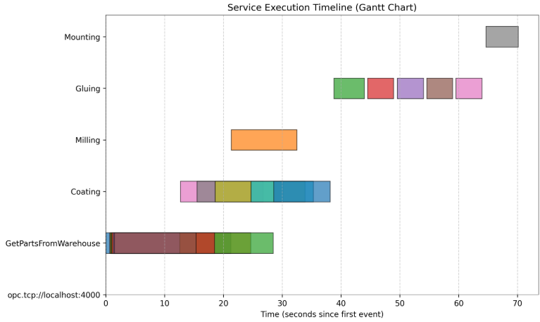

..
    Licensed under the MIT License.
    For details on the licensing terms, see the LICENSE file.
    SPDX-License-Identifier: MIT

    Copyright 2023-2024 (c) Fraunhofer IOSB (Author: Johannes Engel)
===========================
SWAP-IT-Visualization-Tool
===========================

The SWAP-IT-Visualization-Tool is a software component for the visualisation of processes, which was developed as part of the
`Fraunhofer lighthouse project SWAP-IT <https://www.produktion.fraunhofer.de/en/research/research-cooperations/lighthouse-projects/swap.html>`_.
Further information about the SWAP-IT software modules can be found within the `SWAP-IT Demonstration Scenario <https://github.com/swap-it/demo-scenario>`_.
The SWAP-IT-Visualization-Tool is a Tool to visualize the current state of a Shop Floor.

General Setup
=============

.. figure:: /images/general_setup.png
   :alt: Overview
   :width: 100%

   **Figure 1:** General Setup

Figure 1 shows what the tool looks like, when it is initially started.
As a part of the SWAP-IT infrastructure, it is possible to start execution engines from the Visualisation-Tool.
To learn more about the SWAP-IT Execution Engine visit the `GitHub of Execution Engine <https://github.com/FlorianDue/swap-it-execution-engine/tree/order_priorization>`_.

Overview
========

The Visualization Tool displays the **status of resources** within the SWAP-IT infrastructure and visualizes all **configurations and properties** associated with those resources. 
Users can immediately see which resources are active, review their current parameters, and observe metrics such as queue history or real-time utilization. 
In addition, the tool integrates with the SWAP-IT Execution Engine, allowing execution engines to be started directly from the interface.

Key functionalities include:

- **Status Display**: Shows the health, availability, and lifecycle state of every resource.
- **Detail View**: Clicking on a resource opens a sidebar containing dropdown menus for all configuration parameters, real-time metrics, and a plot can be made of the resource’s queue history.
- **Execution Engine Integration**: Start new execution engines, either single instances or campaigns via a menu command.

User Interface Details
======================

When the tool is started initially, the main window appears as shown in Figure 1 (with the default shop floor). The layout is divided into several regions:

1. **Navigation Bar (Top-Left)**  
   Represented by three horizontal stripes.  
   - Contains commands for starting orders (“Start Order”).  

2. **Resource Overview**  
   Displayed in the central area, all registered resources appear in their specified shape, height and width. 
   The shape is either a smoothed rectangle (``"static": true``) or a circle (``"static": false``) specified by the config. 
   The ``service_name`` is directly projected on the resource. 
   States of the resources like idle “Idle”, “Unknown”, “Error”, ... are represented by the color of the displayed resource.  

   +-----------+-----------+-------------+--------------+-----------+-----------+-----------+
   | Color     | Gray      | Green       | Yellow       | Red       | Blue      | Purple    |
   +===========+===========+=============+==============+===========+===========+===========+
   | State     | unknown   | operational | initializing | error     | idle      | executing |
   +-----------+-----------+-------------+--------------+-----------+-----------+-----------+
   | Code      | "0"       | "1"         | "2"          | "3"       | "4"       | "5"       |
   +-----------+-----------+-------------+--------------+-----------+-----------+-----------+

   .. figure:: /images/colors.png
      :alt: Arguments
      :width: 100%

      **Figure 2:** Illustration of colors representing their state

   There is a little button on every resource with the label ``Events``. 
   If a process is pushing events of a resource, the event logging looks like this:

   .. figure:: /images/events.png
      :alt: Arguments
      :width: 30%

      **Figure 3:** Example of event logging

   Clicking on ``Delete`` in the top right corner, removes the memory of all previos event information.   

3. **Sidebar (Right)**  
   Initially hidden; slides in when a user clicks on a specific resource. Contains detailed information broken into collapsible panels.

4. **Sidebar (Left)**  
   Initially hidden; slides in when a user clicks on the three stripes (menu symbol) in the top left corner of the canvas. Contains multiple Opportunities for the user.

Right Sidebar with Detailed Information
=======================================

.. figure:: /images/right_sidebar.png
   :alt: Overview
   :width: 30%

   **Figure 4:** Right Sidebar

Clicking on a single resource causes the **sidebar** to slide in from the right, it is shown in Figure 2. 
The sidebar is divided into collapsible sections (dropdown menus) as follows:

General Information
-------------------

- **Application Name**: Unique identifier  
- **Service**: e.g., “CNC”, “Milling”, “Coating”, ...  
- **Location**: x- and y-coordinates on the shop floor grid for visualisation
- **Shape**: Width and height or radius of the resource's icon
- **State**: Translation from color to state, like "executing", "idle", ... 
- **IP-address**: Like an URL
- **Port**: The Port of the resource
- **Capabilities**
- **Queue**: List of current To-Dos for the resource

There are also two buttons on the side bar. 
One generates a plot of the resource's queue length over the execution time (starting with the first entry).
The other one shows this plot. 

.. note::
   Sometimes it takes a while until the plot of the queue length is produced but usually it should not take longer than a few seconds.

This is what such a plot can look like:

.. figure:: /images/lineplot.png
   :alt: Overview
   :width: 100%

   **Figure 5:** Example of a resource's queue, plotted over time

Left Sidebar with Operating Opportunities
=========================================

.. figure:: /images/left_sidebar.png
   :alt: Overview
   :width: 30%

   **Figure 6:** Left Sidebar

Clicking on the three stripes (menu symbol) in the top left corner of the canvas opens a sidebar from the left side of the screen.
There are two dropdown point to choose from.
The first one is **Start Order** and the second one is **Plot Queue**.
1. **Start Order**
   Clicking on Start Order opens a dropdown with the options: **Order History** and again **Start Order**.
   - **Order History**: This opens yet another dropdown with three options. 
   The first option **Generate Gantt Chart** is to generate a Gantt Chart of the process after the process is finished or during a running process. 
   This generated Gantt Chart can be shown by the second option in the dropdown **Show Gantt Chart**. 
   The plotting takes up to several seconds, so don't click **Show Gantt Chart** immediately. 
Here is an example, how a Gantt chart can look like:

   **Figure 7:** Example of a Gantt chart for a finished process

    The third button **Clear History** is used to clear the produced chart to restart the measurement.
    - **Start Order**: Starting an **Execution Engine** is done by clicking **Start Campaign** or **Start single Order**. The only difference among those two is that the default value of started orders is ``5`` for a started Campaign and ``1`` for a single Order. The modal that pops up is discussed further in section :ref:`Starting an Execution Engine`.
2. **Plot Queue**
    Here you can generate a Heatmap of an ongoing or finished process. 
    - Clicking **Generate Heatmap of Queues** initiates, that all queues of every resource on the shopfloor is plotted in one diagramm.
    - Clicking **Show Heatmap** shows the generated plot.
    Here is an example, how a Heatmap can look like:

   .. figure:: /images/heatmap.png
      :alt: Overview
      :width: 80%

      **Figure 8:** Example of a Heatmap for a finished process
   

.. toctree::
   :maxdepth: 2

   Starting_an_execution_engine
   JSON_config